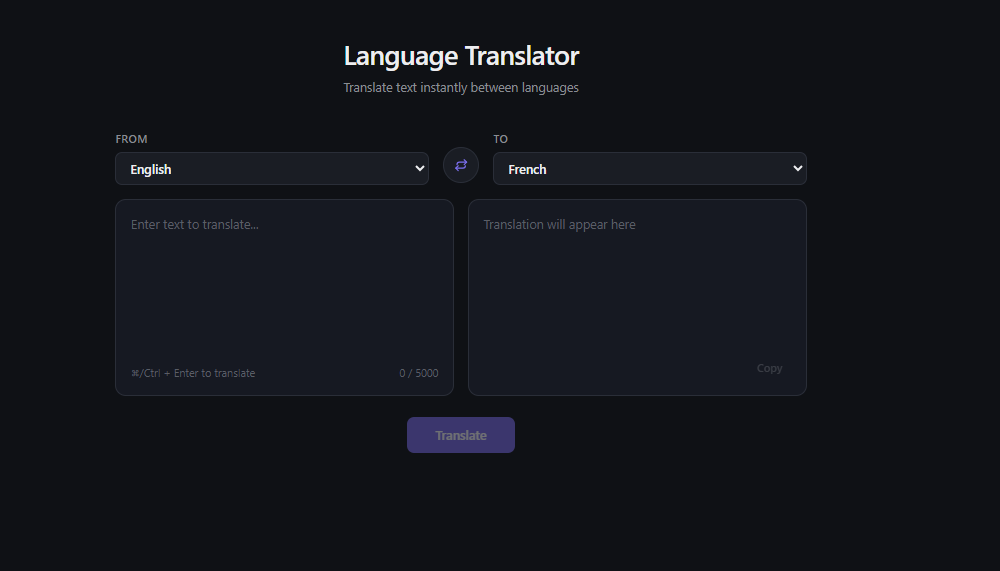
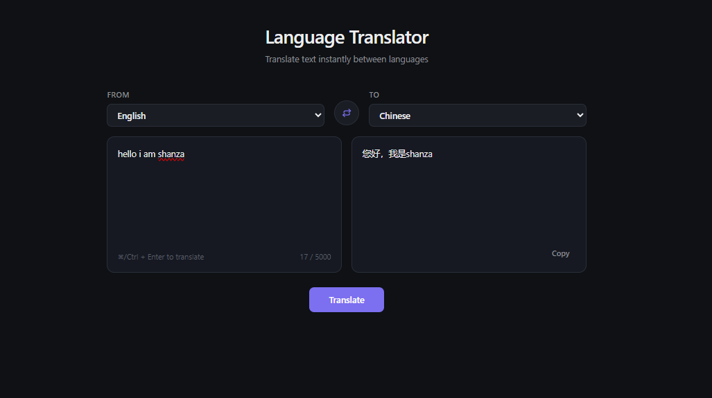

# Language Translator

A full-stack language translation tool built with React, TypeScript, and FastAPI. Enter text, pick a source and target language, and get an instant translation — with a clean, accessible, responsive UI.



## Overview

This project demonstrates a complete, production-style implementation of a translation service: a typed React frontend communicating with a FastAPI backend, which itself proxies requests to the [MyMemory Translation API](https://mymemory.translated.net/). It was built as a structured, phase-by-phase engineering exercise — covering planning, clean architecture, API integration, accessibility, and documentation, in that order, the way a real feature would be built on a professional team.

## Features

- **Text translation** between 12+ languages, with auto-detect support
- **Language swap** — instantly flip source/target with a single click
- **Copy to clipboard** with visual confirmation
- **Loading and error states** — graceful handling of network failures, invalid input, and provider errors
- **Input validation** — character limits, blank-text prevention, same-language detection
- **Keyboard shortcut** (`Cmd/Ctrl + Enter`) to translate without leaving the keyboard
- **Accessible by design** — `aria-live` announcements, visible focus states, `prefers-reduced-motion` support
- **Fully responsive** — usable from mobile to desktop
- **Auto-generated API docs** via FastAPI's Swagger UI

## Architecture

```
Browser (React)
     │
     │  POST /api/translate  (JSON, over HTTP)
     ▼
FastAPI Backend
     │
     │  api/translate.py       → thin route, no business logic
     │  services/translation_service.py  → calls MyMemory, owns all provider-specific logic
     │  schemas/translation.py → Pydantic request/response validation
     ▼
MyMemory Translation API
```

The backend acts as a **Backend-for-Frontend (BFF)**: the React app never talks to MyMemory directly. This keeps the translation provider swappable (only `translation_service.py` would need to change), keeps any future API keys off the client, and lets the backend own validation, error normalization, and logging in one place.

**Design principle followed throughout:** routes contain no logic — they validate, delegate to a service, and translate exceptions into HTTP responses. Business logic lives exclusively in the service layer.

## Folder Structure

```
language-translation-tool/
├── frontend/
│   ├── src/
│   │   ├── components/    # Reusable UI pieces (LanguageSelector, SwapButton, CopyButton, Spinner)
│   │   ├── pages/          # Full page views (TranslatorPage)
│   │   ├── hooks/          # Stateful logic (useTranslate)
│   │   ├── services/       # Axios API layer, isolated from UI
│   │   ├── types/          # Shared TypeScript interfaces
│   │   ├── App.tsx
│   │   └── main.tsx
│   └── ...
├── backend/
│   ├── app/
│   │   ├── api/             # Route definitions only
│   │   ├── services/        # Business logic (MyMemory integration)
│   │   ├── schemas/         # Pydantic request/response models
│   │   ├── core/             # Custom exceptions
│   │   ├── config/           # Environment variable loading
│   │   ├── middleware/       # Reserved for cross-cutting concerns
│   │   ├── utils/             # Reserved for shared helpers
│   │   └── main.py
│   └── requirements.txt
├── screenshots/
├── docs/
└── README.md
```

## Technology Stack

| Layer | Technology |
|---|---|
| Frontend | React, Vite, TypeScript, Tailwind CSS, Axios |
| Backend | Python, FastAPI, Pydantic, httpx |
| Translation Provider | MyMemory Translation API |
| Docs | FastAPI Swagger UI (auto-generated) |

## Installation

**Prerequisites:** Node.js 18+, Python 3.11+

```bash
git clone https://github.com/<your-username>/language-translation-tool.git
cd language-translation-tool
```

**Backend:**
```bash
cd backend
python -m venv venv
source venv/bin/activate   # Windows: .\venv\Scripts\activate
pip install -r requirements.txt
```
Create `backend/.env`:
```
ENVIRONMENT=development
CORS_ORIGINS=http://localhost:5173
MYMEMORY_API_URL=https://api.mymemory.translated.net/get
```

**Frontend:**
```bash
cd frontend
npm install
```
Create `frontend/.env`:
```
VITE_API_BASE_URL=http://localhost:8000
```

## How to Run

Two terminals, from the project root:

```bash
# Terminal 1 — backend
cd backend && source venv/bin/activate && uvicorn app.main:app --reload --port 8000

# Terminal 2 — frontend
cd frontend && npm run dev
```

Visit `http://localhost:5173`.

## API Documentation

Once the backend is running, interactive API docs are available at:
**`http://localhost:8000/docs`**

### `POST /api/translate`

**Request:**
```json
{
  "text": "Hello, how are you?",
  "source_lang": "en",
  "target_lang": "fr"
}
```

**Response:**
```json
{
  "translated_text": "Bonjour comment allez-vous?",
  "source_lang": "en",
  "target_lang": "fr"
}
```

| Status | Meaning |
|---|---|
| 200 | Success |
| 400 | Same source and target language |
| 422 | Invalid request body (validation error) |
| 502 | Translation provider returned an unexpected response |
| 503 | Translation provider unreachable |

### `GET /health`

Returns `{"status": "ok", "environment": "development"}` — used to verify the API is running.

## Screenshots



## Future Improvements

- Swap MyMemory for a paid provider (Google Cloud Translation, DeepL) for higher-volume production use
- Add translation history with local persistence
- Add a debounced "translate as you type" mode
- Add automated tests (pytest for backend, Vitest/React Testing Library for frontend)
- Add rate limiting on the backend to protect the free-tier MyMemory quota
- Deploy backend (Render/Railway) and frontend (Vercel/Netlify) with CI/CD via GitHub Actions

## Author

**Shanza Ashraf**

Computer Science student and aspiring AI Engineer with interests in Machine Learning, Deep Learning, Large Language Models (LLMs), AI Agents, and Full-Stack AI Applications.

- GitHub: https://github.com/<shanzaashraf003>
- LinkedIn: https://www.linkedin.com/in/<https://www.linkedin.com/in/shanzaashraf/>/


## License

MIT — see [LICENSE](LICENSE) for details.